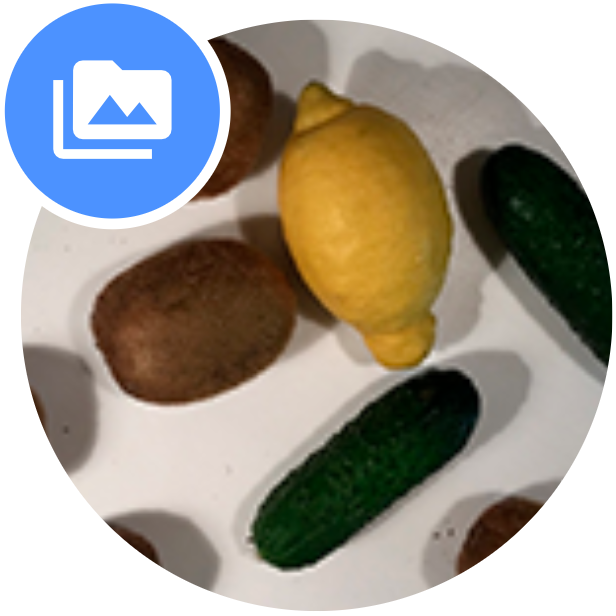
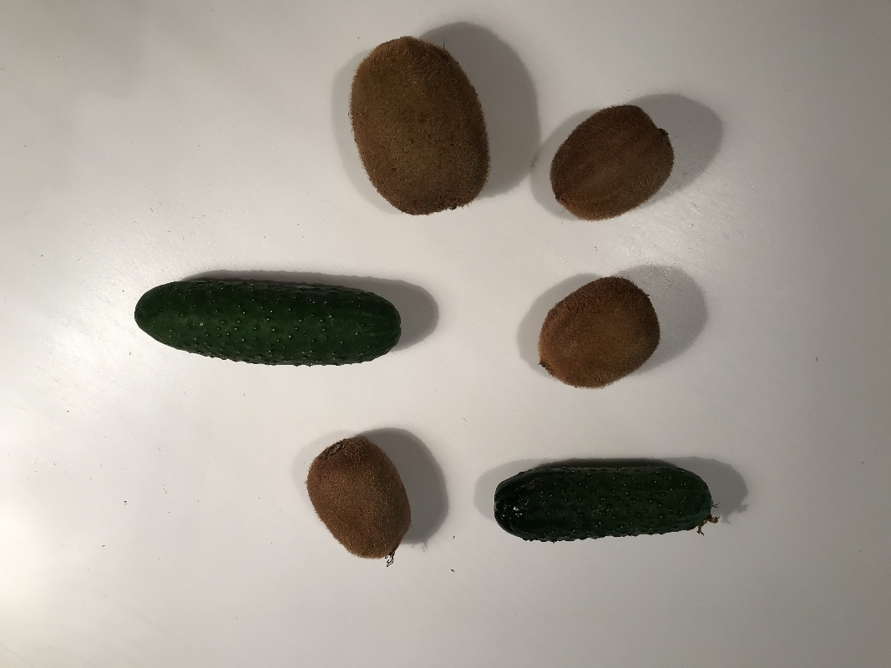

 

  

 

# Lemons Test  

  <a href="#overview">Overview</a> •
  <a href="#description">Description</a> •
  <a href="#download">Download</a> •
  <a href="#statistics">Statistics</a> •
  <a href="#examples">Examples</a> •
  <a href="#how-to-import">How to Import</a> 

 

## Overview 

 `lemons_test` is an example project with 6 unlabeled images. 

## Description 

`lemons_test` is a small demo project, perfect for flash testing of segmentation and detection models. It can be used to test neural networks on a small amount of images.

## Download

Direct download: [tar archive](https://cloud.enterprise.deepsystems.io/s/P9AlIyasKXshiZD/download) (1,14 MB).

## Statistics

Project contains 1 dataset with 6 images in it, without annotations. 

## Examples

  

## How To Import

...
