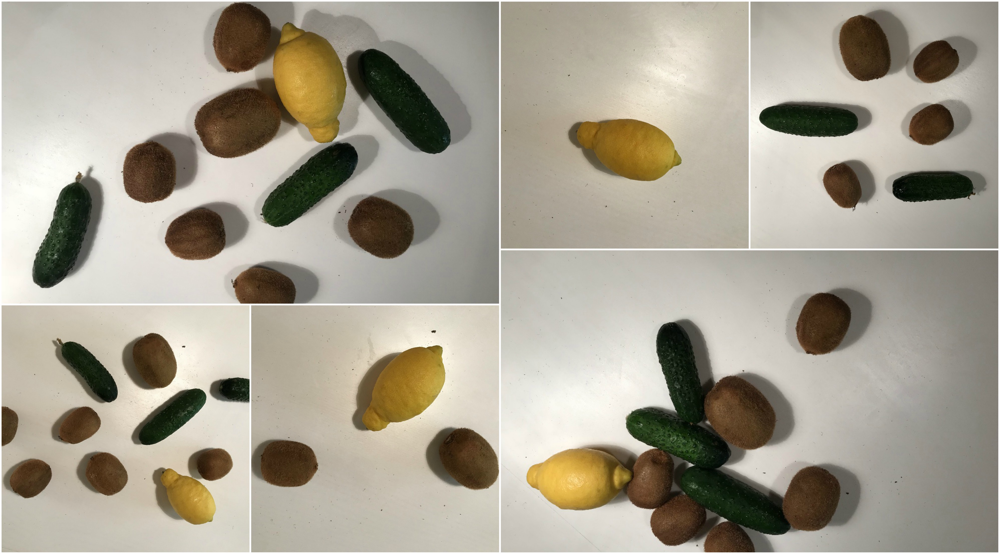

 

 

 # Lemons Test  

  <a href="#overview">Overview</a> |
  <a href="#description">Description</a> |
  <a href="#download">Download</a> |
  <a href="#statistics">Statistics</a> |
  <a href="#examples">Examples</a> |
  <a href="#how-to-import">How to Import</a> 

## Overview 

 `lemons_test` is an example project  without annotations with 6 images in it. 

## Description 

`lemons_test` is a small demo dataset, perfect for flash testing of segmentation and detection models. It can be used to test neural networks on a small amount of images.

## Download

Direct download is available [here](https://cloud.enterprise.deepsystems.io/s/P9AlIyasKXshiZD/download).

## Statistics

Dataset consists of 6 images without annotations. 

## Examples

   

## How To Import

...
